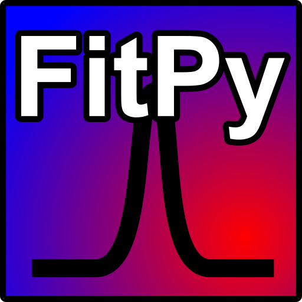

<p align="center">
    
</p>


# Fittingpy - IR Spectrum Analysis and Deconvolution Tool

## Overview

<p align="justify">
This project is a Python-based graphical application designed for analyzing and deconvoluting infrared (IR) spectra. Currently, the tool provides functionality for visualizing IR spectra provided by the user. The ultimate goal is to implement dynamic and precise deconvolution of absorption peaks, followed by analytical features for calculating cross-sections related to the formation and destruction of chemical species.
</p>

<p align="justify">

</p>


## Features
1. Data Visualization: Users can load and plot IR spectrum data files.
2. Interactive Graphs: The application provides an intuitive interface for adjusting plot parameters such as offsets and color palettes.
3. Dynamic Color Palettes: Allows selection from predefined color schemes for better visualization.

## Future Goals:
- [ ] Implementation of peak deconvolution.
- [ ] Analysis of formation/destruction cross-sections.
- [ ] Export analyzed data such as deconvolutiuons and chemical evolution.

## Installation

- Prerequisites: Python 3.12.8 (or higher)
- Required Python libraries:
    - numpy       -> version 1.26.4 (or higher)
    - matplotlib  -> version 3.9.0 (or higher)

> [!TIP]
> You could installed using `pip install numpy matplotlib`

- Follow the steps to install the application
    1. Clone the Repository
    2. Clone this repository from GitHub:
        ```
        git clone https://github.com/GuilleTCast/Fittingpy.git
        cd Fittingpy
        ```

- Usage
    - Run the application through the terminal: `python main.py`
    - Use the graphical interface to:
        1. Load your IR spectrum data (supports .dat and .txt files).
        2. Visualize the spectra with adjustable offsets and color palettes.

## File Format
- First column: represents the wavenumber in cm<sup>-1</sub>.
- Subsequent columns represent optical depth values of each IR spectrum.

An example of the file structure is as follows:

```
+-------------------+-------------------+-------------------+-------------------+-------------------+
| Wavenumber (cm⁻¹) |  IR spectrum #1   |  IR spectrum #2   |       ...         |  IR spectrum #n   |
+-------------------+-------------------+-------------------+-------------------+-------------------+
|      4000         |      0.123        |      0.456        |       ...         |      0.789        |
|      3990         |      0.234        |      0.567        |       ...         |      0.891        |
|      3980         |      0.345        |      0.678        |       ...         |      0.912        |
|      ...          |       ...         |       ...         |       ...         |       ...         |
+-------------------+-------------------+-------------------+-------------------+-------------------+
```

> [!NOTE]
> The data in the representation is an example generated with random numbers.

> [!TIP]
> Support comments started with '#' or first row headers, but not combined.

## Error Logging

Any issues during execution will be logged in error.log in the current working directory.

## Features Under Development

- Dynamic Peak Deconvolution: Algorithms for deconvoluting overlapping absorption peaks.
- Cross-Section Analysis: Calculations for formation and destruction cross-sections of related species.

# Contributing

Contributions are welcome! To contribute:
1. Fork this repository.
2. Create a new branch for your feature or bugfix.
3. Submit a pull request for review.

# License

This project is licensed under the GNU General Public License v3.0. See the [LICENSE](https://github.com/GuilleTCast/Fittingpy/blob/main/LICENSE) file for details.

# Acknowledgments

This tool is designed to assist researchers working with IR spectra, enabling efficient data visualization and analysis.

